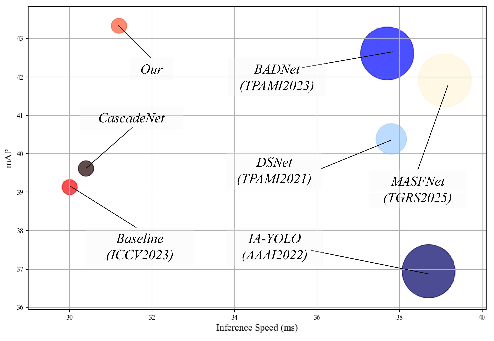

## Considering Degeneration Aerial Object Detection Network Under Adverse Weather Conditions and A large-Scale Multi-Degradation Aerial Detection Dataset

## Abstract

## PipLine
 

## Project Introduction
The project is based on the [Diffusiondet](https://github.com/ShoufaChen/DiffusionDet) and [detectron2](https://github.com/facebookresearch/detectron2), maintaining the overall framework unchanged. For specific usage, you can refer to the [detectron2 documentation](https://detectron2.readthedocs.io/en/latest/).
## Datasets
We provided the download links for the Multi-Degradation Aerial Detection Dataset(MDADD) mentioned in the work. The download links are as follows:
 https://pan.baidu.com/s/1JKQvNdOp8ngSa87k0QosRg?pwd=epb2

## Models
We also provided the pre-trained models, including models trained on Foggy, Dust, Low_light, and Mix Dataset:

|   Models    | Download|
|:----------:|:---:|
   Foggy     | [model](https://pan.baidu.com/s/19eb_6zKkXPXndxl8vOP2Kg?pwd=82yu)
    Dust     | [model](https://pan.baidu.com/s/1Zd0psj8RlSw6X_CLCj224g?pwd=4m42)
 Low_light   | [model](https://pan.baidu.com/s/1Kq1DOnmcNHkVWuVwtrEhzw?pwd=ipbi)
    Mix      | [model](https://pan.baidu.com/s/1FdoW0unRWKehLFqHb6COsA?pwd=jk5d)

